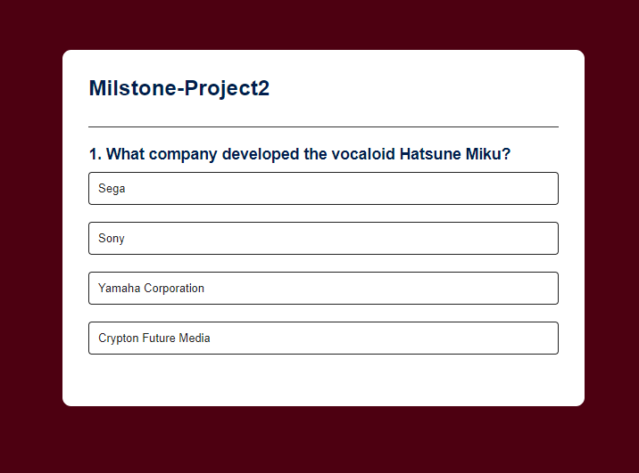

# Milestone-Project2

## Overview

This project is a simple quiz app developed using HTML, CSS, and JavaScript. It allows users to take a quiz with multiple-choice questions and provides instant feedback on their answers.


## Features

- **Multiple-Choice Questions**: Users can answer multiple-choice questions.
- **Instant Feedback**: Users receive instant feedback on their answers.
- **Score Tracking**: The app tracks the user's score and displays it at the end of the quiz.
- **Retry Option**: Users can retry the quiz after completing it.

## Installation

1. Clone the repository:

    ```
    git clone https://github.com/yourusername/quiz-app.git
    ```

2. Open the `index.html` file in a web browser.

## Usage

1. Start the quiz by opening the `index.html` file in your web browser.
2. Answer each question by selecting the correct option.
3. Click the "Next" button to move to the next question.
4. After completing the quiz, view your score and retry the quiz if desired.

## Acknowledgments

This project was inspired by the tutorial from [CodeExplained](https://www.youtube.com/watch?v=riDzcEQbX6k&ab_channel=CodeExplained) on YouTube. The tutorial provided valuable insights into building interactive quiz applications using JavaScript.

## API Integration

The quiz app retrieves questions from the [Open Trivia Database API](https://opentdb.com/). The API provides a wide range of trivia questions across different categories and difficulty levels.

## Screenshot




# Code Validation

## Index (Home) HTML


## About HTML


## Instructions HTML


## CSS Style


